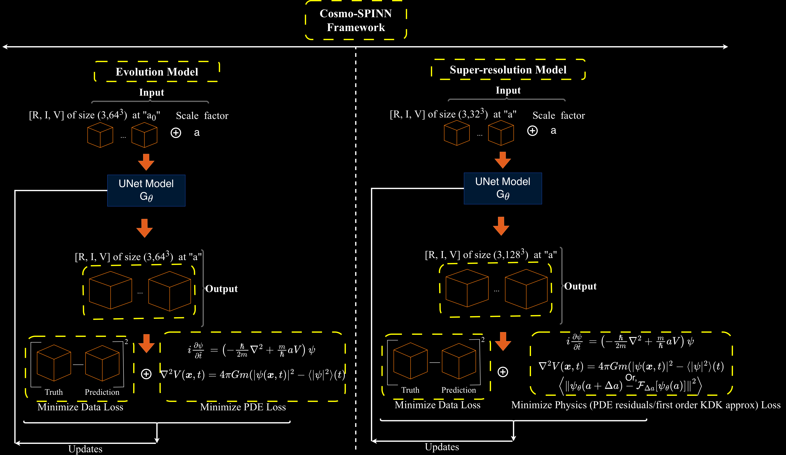

# Cosmo-SPINN

<p align="center">
  
</p>

## Overview

We present **Cosmo-SPINN**, a physics-informed U-Net-based generative framework for fuzzy dark matter (FDM) simulations governed by the Schrödinger–Poisson equations.

The framework addresses two complementary tasks:

1. **Field evolution:** Predicting cosmological FDM fields from initial conditions to an arbitrary scale factor.
2. **Super-resolution:** Generating high-resolution FDM fields from low-resolution simulations at a specified scale factor.

## Paper

**Cosmo-SPINN: Physics-Informed Generative Modeling of Fuzzy Dark Matter Simulations**

[Read the paper on arXiv](https://arxiv.org/abs/2607.28604)

### Citation

If you use this code or the associated models, please cite:

```bibtex
@article{mishra2026cosmospinn,
  title         = {Cosmo-SPINN: Physics-Informed Generative Modeling of Fuzzy Dark Matter Simulations},
  author        = {Mishra, Ashutosh Kumar and Tolley, Emma},
  year          = {2026},
  eprint        = {2607.28604},
  archivePrefix = {arXiv},
  primaryClass  = {astro-ph.CO},
  url           = {https://arxiv.org/abs/2607.28604}
}
```

## Repository Structure
The linked zenodo for this repository: DOI 10.5281/zenodo.22816378
```text
DeepWaves.Cosmo-SPINN/
├── Models/          # Model architectures
├── Trainer/         # Training scripts
├── Plot_scripts/    # Figure reproduction scripts
├── utils/            # Utility functions
├── requirements.txt
├── LICENSE
└── README.md
```

## Installation

Clone the repository:

```bash
git clone https://github.com/akmdevx/DeepWaves.Cosmo-SPINN.git
cd DeepWaves.Cosmo-SPINN
```

Install the required dependencies:

```bash
pip install -r requirements.txt
```

For GPU-enabled PyTorch installation, see the [PyTorch installation guide](https://pytorch.org/get-started/locally/).

## Data and Trained Models

The simulation data and trained model weights are available separately:

* **Simulation data:** [Zenodo record](https://zenodo.org/uploads/22734983)
* **Trained model weights:** [GitHub Releases](https://github.com/akmdevx/DeepWaves.Cosmo-SPINN/releases/)

Download the required files and update the corresponding paths in the scripts before running them.

## Reproducing the Figures

The `Plot_scripts/` directory contains the scripts and instructions required to reproduce the figures in the paper.

| Figures   | Script                                          |
| --------- | ----------------------------------------------- |
| Fig. 1    | Created using [draw.io](https://www.drawio.com) |
| Fig. 2a   | `plot_eval_data_loss.py`                        |
| Fig. 2b   | `plot_eval_SP_loss.py`                          |
| Fig. 3a   | `plot_SR_SP_loss.py`                            |
| Fig. 3b   | `plot_SR_KDK_loss.py`                           |
| Figs. 4–5 | `sample_evol1.py`                               |
| Figs. 6–7 | `sample_SR.py`                                  |
| Fig. 8    | `sample_evol_mr.py`                             |

See the [Plot_scripts README](Plot_scripts/README.md) for detailed instructions.

## License

This project is released under the [MIT License](LICENSE).

## Contact

For questions or issues, please open an issue in this repository.

---

**Repository:** [DeepWaves.Cosmo-SPINN](https://github.com/akmdevx/DeepWaves.Cosmo-SPINN)

**Author:** [Ashutosh Kumar Mishra](https://github.com/akmdevx)


<!--  -->

FDM Simulation from z = 127 to z = 0 for one of the realizations of the initial condition (IC):

